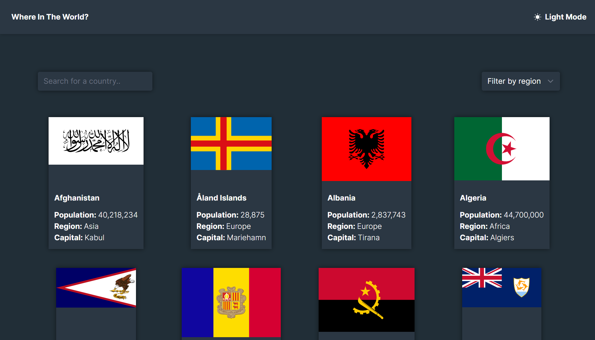

# Frontend Mentor - REST Countries API with color theme switcher solution

This is a solution to the Frontend Mentor challenges help you improve your coding skills by building realistic projects.

## Table of contents

- [Overview](#overview)
  - [The challenge](#the-challenge)
  - [Screenshot](#screenshot)
  - [Links](#links)
- [My process](#my-process)
  - [Built with](#built-with)
  - [What I learned](#what-i-learned)
  - [Continued development](#continued-development)
  - [Useful resources](#useful-resources)
- [Author](#author)

## Overview

### The challenge

Users should be able to:

- See all countries from the API on the homepage
- Search for a country using an input field
- Filter countries by region
- Click on a country to see more detailed information on a separate page
- Click through to the border countries on the detail page
- View the optimal layout for the interface depending on their device's screen size
- See hover and focus states for all interactive elements on the page
- Bonus: Toggle the color scheme between light and dark mode

  
### Screenshot

### Links

- Solution URL: [solution url](https://github.com/louis-bamidele/project1-spaceTourismWebsite)
- Live Site URL: [live site](https://louis-country-api-app.netlify.app)

## My process

### Built with

- next.js
- react.js
- tailwind css
- Flexbox
- grid
- Mobile-first workflow
- JavaScript

### What I learned
I learnt a lot while working through this project. I would love to show you the codes I'm proud of but I can't really decide which code specifically, because I'm proud of all these codes. react really helped and i look forward to using it more. 

### Continued development
I would really love to learn more api and alot more 

- name - 
- Frontend Mentor - [@louis7734](https://www.frontendmentor.io/profile/louis7734)
- Twitter - [@l0uis_77](https://twitter.com/l0uis_77)

